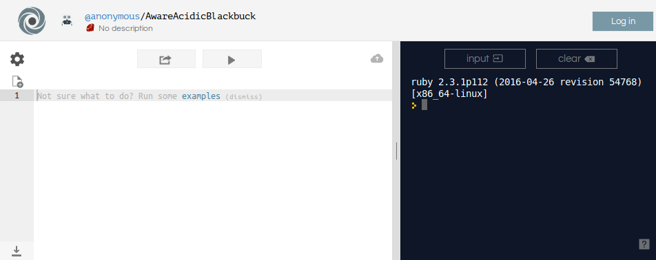
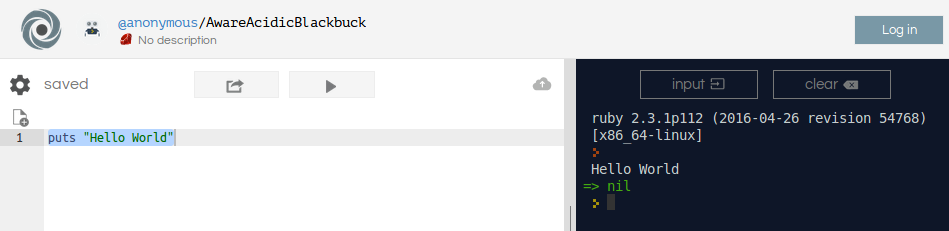

# Prologue
##  The programmers black book
Every journey begins with a single step, but

_Abandon all hope, ye who enter here_

## Fly you fool
So, you want to start a career as a programmer? Are you sure? You are in time to step back before it’s too late.Upon you lies a twisted path with traps and obstacles along the way, apparently light but dark and full of terrors as a night without moon.
There are many ways through the labyrinth for you to choose. What about the way of the enterprise programmer? Databases, infinite forms, input validation, formatted output and absolute boredom. There is also the web ecosystem, the nightmarish ever-evolving frontend and the shape-shifting backend that creeps from a hard disk to containers or even to the serverless no-man-land. Or why not to try the mobile development, the ultimate mutating unnamable terror that lurks in everyone hands, mesmerizing their owners with neverending notifications.
Other corridors await behind new doors that came out of nowhere: iot, wearables, big-data, deep learning, blockchain, you name it. Coders may not be aware, but they’ve achieved their ultimate goal: to take over the world. Sounds pretentious? Just think a little bit, and imagine how many of your day by day routines are transferring data up and down, through systems that some programmer has created.

## Let me tell you a little secret
Computers are stupid. They may have incredible capabilities for processing millions of instructions and processing data, transform streams of 0s and 1s into images, emails, music and information,… but, ultimately, computers do what they are told to.
Even smartphones, despite their fancy name, thye are just a dumb piece of machinery. They also need instructions to run or they are just useless. And what are those instructions? Programs. And programs are written by programmers.
There are lots of different kind of languages to give instruction for a computer. They all try to look like a natural language and before they are executed, the computer translates these programs to something they can deal with. Sometimes creating a different file (compilation) and sometimes translating on the fly (interpretation).
So, a program is a set of instructions for the computer to do some task. They normally have an input, then they process that following the instructions and finally they give an output or a result. And normally, a program solves a given problem, ranging from simple actions to complex operations.
Depending on the complexity of the problem they need to solve, programs may (must) be organized in different components working together. And good programmers know how to organize these components to make them work together (cohesion, good) without overlapping their duties (coupling, bad). Once you learn the basics, you should follow the way of the software craftsmen and try not only to solve problems, but also produce quality software, clean and maintainable.

## Ready
Every journey starts with a footstep, and the HelloWorld is the traditional ritual to be initiated when you learn a new programming language. This ceremony consists of setting any given development environment and being able to show the well-known “Hello World” on screen. That is the first step to gain confidence from the very beginning. Here we will provide many options, if you are not able to get a Hello World with any of these, man, you better run and don’t look back, abandon all hope of make a living off this. Your life will be much happier and your nerd friends, with a bit of luck, will show some mercy.

### Online programming
Righ now there are a plethora of websites and apps offering you online environments to learn to program and write and run programs. You don’t need to install anything, you just need to have a web browser and oops, Internet connection.

### Install a IDE
So, you don’t like to depend on the Internet? I hope that you can get connected for a while to download anything.
Last options
Well, and your last option is to use some of these. But all of them are a real pain in the ass for a beginner, and most are tough languages with non-existent editors.

- 1. The developer console of a Web Browser, for JavaScript
- 2. Any console:
  - 1. Windows + cmd: for batch “language”
  - 2. Windows + powershell: for powershell language
  - 3. Unix-like, Mac shell: bash or any similar scripting language
  - 4. Consider throwing away your computer before you try any of those

##Steady?
Open a browser go to https://repl.it and choose Ruby from the list. Or go directly to https://repl.it/languages/ruby You will see something like this:



There are two panels on this page:
- 1. On the left is where you will write your code. The editor highlights the words to help you while you write your programs.
- 2. On the right is where you see the result of your code when you click on the “play” button.

This site has many other options, the one you should care about is to signup for a better management of your code. You will also be able to have your nickname in your creations.

## Hello World
Write this in the editor

```ruby
puts “Hello World”
```
And now press play.

This is what you’ll get:



Congratulations! You were able to write a correct program. Not a killer app though.

## Data
Computer engineering, in abstraction, is the discipline of the transformation of data. Data, values, information, that is the center of the computer universe. Data is the primary good that a program must manage,  sometimes as raw material, others encoded for other programs and often formatted data ready for human consume.
In order to transform data, a program needs the means to hold it, and the most common way to do it is using variables. Variables are containers capable of saving data. In our programs, we can define variables where we can store, change and retrieve this data. The typical types of data are:
1. Numbers, with or without sign, with decimals, with a different base, etc.
2. Strings, letters, or single characters
3. Booleans, variables that can only hold two values: true or false
4. Null, no data at all

Defining data is pretty easy. Just think of a suitable name and assign a value, like this:
```ruby
number = 666
```
There you have: a variable called number holding a value 666. You can change that value depending on the needs of your code.

### Naming
Well, what is a _suitable name_?
This is not a minor issue, and even seasoned coders tend to forget the importance
of giving proper names to program componentes, starting from the humblest variables. So don't forget these rules when you choose names form variables, functions, and any other element:

- Names should be meaningful
- Names should reveal purpose
- Names should explain

when we are dealing with variables, choose names, not verbs or adverbs. And of course, avoid generic names or abbreviations of any kind.

### Data types
Languages can be typed or not, strongly or weakly typed, explicitly or implicitly typed. When languages are strongly typed, you have to declare the variable (or any other component) with a specific type. Whatsmore, a variable type cannot be changed and you can't store any value that is different or non-compatible with that type.
In languages like Ruby, and in most interpreted languages, you don't specify the type. But be careful, because Ruby cares about the typing.

#### Numbers
Numbers are declared plainly, even if they are negative or positive or with decimals:

```ruby
age = 25
weight = 76.542
temperature = -10.05
```

#### Strings
Are characters, words, phrases, or any form of text.

```ruby
wizard = 'Gandalf the grey'
name = "Geralt de Rivia"
withTabs = 'Long text with \' and with \t tabs and \n newlines'
```

#### booleans
Booleans are values that they can only be either true or false, and they are widely used in programming, mainly for decision making. Depending on the language, there could be other values with the same meaning as true or false.

```ruby
result = true
i_am_inmortal = false
death_is_certain = true
```

## Ask for data
## Math
## True or false
## Crossroads
## Round, round the garden
## Divite et Vinci
